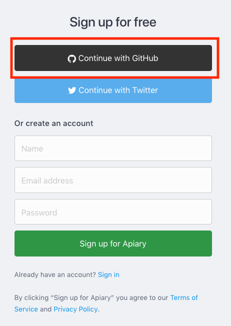
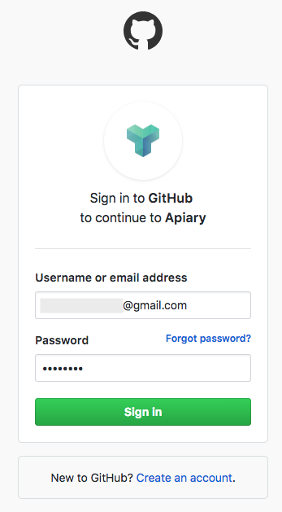
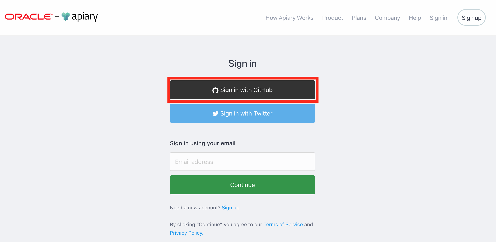
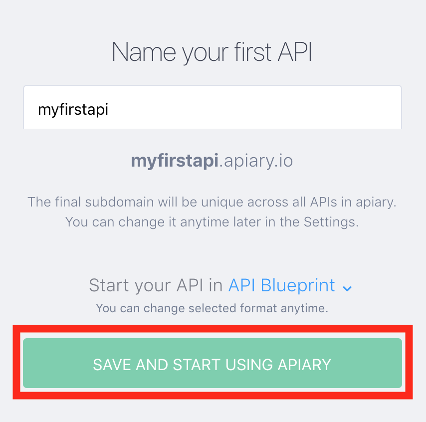
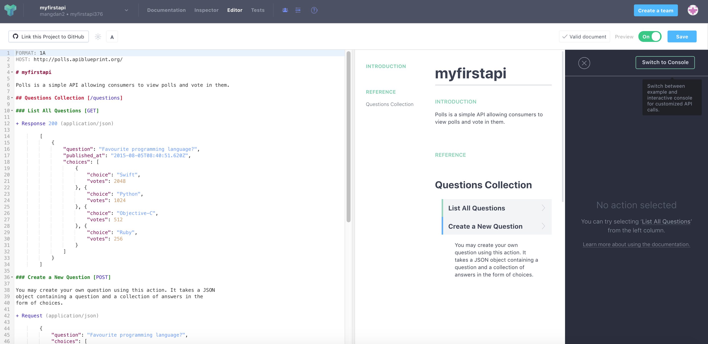
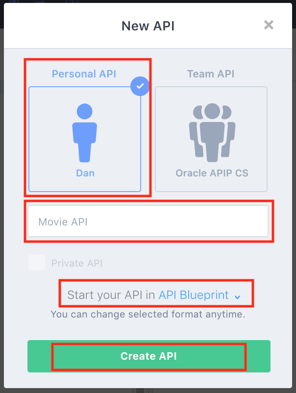
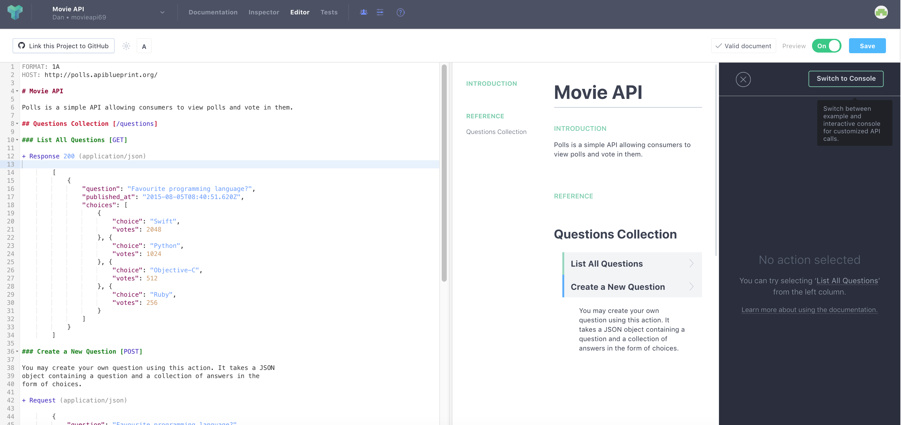

# 마이크로 서비스 개발을 위한 API 우선 설계 및 API 구축하기

본 과정에서는 API Blueprint를 활용하여 API 문서를 만들어 보고, Microprofile 기반의 [Oracle Helidon](http://helidon.io)과 [Oracle Database의 REST Data Service](https://www.oracle.com/database/technologies/appdev/rest.html)로 마이크로 서비스를 구현하는 것을 보여줍니다. 
또한 API 문서와 구현된 서비스간의 비호환 (서비스에 대응하는 문서 호환 여부) 여부를 확인, 검증하는 [Dredd](https://github.com/apiaryio/dredd)와 CI 도구인 [Wercker](https://app.wercker.com/)를 통합하여 API 비호환 테스트를 지속적으로 자동화하는 것을 보여줍니다.
마지막으로 배포된 API에 대한 보안 및 다양한 정책을 적용해 보고, API Gateway에 배포하여 최종적으로 서비스와 문서를 애플리케이션 개발자에게 오픈하는 내용을 담고 있습니다.
본 과정을 통해 오라클 솔루션을 활용하여 마이크로 서비스 개발에 대한 전반적인 라이프사이클을 경험해 보실 수 있습니다.

## 데스크탑  설치 프로그램
* [Java SE Development Kit 8](https://www.oracle.com/technetwork/java/javase/downloads/jdk8-downloads-2133151.html)
* [Node.js](https://nodejs.org/ko/download)
* [Apache Maven](https://maven.apache.org/download.cgi)
* [Git](https://git-scm.com/download/win)
* [Visual Studio Code](https://code.visualstudio.com/download)
* [SQL Developer](https://www.oracle.com/technetwork/developer-tools/sql-developer/downloads/index.html)
* [Insomnia](https://insomnia.rest/download)

## Oracle Cloud 환경
* [Oracle Compute Cloud Service](https://cloud.oracle.com/ko_KR/compute)
* [Oracle Database Cloud Service](https://cloud.oracle.com/ko_KR/database)
* [Oracle API Platform Cloud Service](https://cloud.oracle.com/ko_KR/api-platform)

## 시나리오
1. Apiary에서 API Blueprint 작성하기
2. Helidon (MP)과 ORDS를 사용하여 서비스 개발하고 Dredd를 사용하여 API Blueprint와 Helidon 서비스간 호환 여부 검증 및 테스트하기
3. Wercker와 Dredd, Github을 사용하여 지속적 통합 환경 구축하기
4. API 서비스에 보안 및 정책을 적용하고 API Gateway에 서비스 배포하기


## Apiary 계정 생성하기
먼저 [Apiary(https://apiary.io)](https://apiary.io) 홈페이지에 접속한 후 우측 상단의 **Sign up** 버튼을 클릭합니다.  


**Continue with GitHub** 버튼을 클릭합니다.  
GitHub 계정이 필요합니다. 만약에 없을 경우 [GitHub(https://github.com)](https://github.com)에서 계정을 생성하세요.  


GitHub 계정을 입력하고 **Sign In** 버튼을 클릭합니다.  


verify를 위한 메일이 발송됩니다.  


등록한(로그인) 메일 계정으로 접속하여 verify 메일을 확인하고 **verify email address**를 클릭 합니다.  


다시 Apiary 홈페이지로 접속하여 우측 상단의 **Sign In** 버튼을 클릭한 후 **Continue with GitHub** 버튼을 클릭 합니다.  


다시 GitHub 계정을 입력하고 **Sign In** 버튼을 클릭합니다.  


Apiary 계정을 생성하면 기본 API 하나를 생성해야 합니다. **Name your first API** 부분에 *myfirstapi* 혹은 *helloapiary* 와 같이 임의로 입력합니다.  


축하합니다!! :clap: Apiary 계정을 성공적으로 생성하셨습니다.  
아래 화면은 Apiary 에디터 화면으로 좌측이 에디터, 우측이 실시간으로 만들어지는 API 문서입니다.  


## API Blueprint 문서 만들기
좌측 상단의 API 이름을 클릭한 후 **Create New API Project**를 선택합니다.  


**Personal API**를 선택하고 API 이름은 **Movie API** 라고 입력합니다. 
문서 유형은 API Blueprint와 Swagger 2.0 스펙을 지원하는데, 여기서는 API Blueprint로 문서를 작성합니다.
```
여기서 잠깐!!!
무료 계정을 사용할 경우 Personal API만 만들 수 있습니다. Personal API는 개인적인 용도이며, 작성된 API 문서는 외부에 공개됩니다. 
Enterprise 버전을 구매할 경우 Team API를 만들 수 있습니다. Team API는 팀멤버를 구성하고 해당하는 팀멤버에게만 공유할 수 있습니다.
```
```
여기서 잠깐!!!
API Blueprint와 Swagger는 API 문서 작성 시 가장 많이 사용되고 있는 API 문서 작성 언어입니다.
API Blueprint는 MarkDown 형식으로 작성하며, 가장 작성하기 쉽고 이해하기 쉬운 언어이지만, 스텁이나 스니펫과 같은 코드 생성 
기능을 지원하지 않습니다. Swagger는 현재는 OAS(Open API Specification)라고 불리며(하지만 여전히 개발자들 사이에서는 
Swagger로 불립니다.) YAML 혹은 JSON 형식으로 작성이 되며, 개발자에게 좀 더 친숙하고, 많은 내용을 담을 수 있기 때문에 비 개발자에게는 
다소 복잡하게 느껴질 수 있습니다. API Blueprint에 비해서 복잡하고 어렵지만, 다양한 언어의 스텁 코드를 생성할 수 있는 기능
(Swagger Codegen)과 같은 기능을 제공하며, 이미 만들어져 있는 API에서 바로 Swagger 문서를 만들 수 있습니다
(ex. spring-boot api -> swagger). 
Swagger는 문서의 복잡성이 높기 때문에 문서를 먼저 만들고 API를 만들기 보다는 이미 만들어진 API에서 Swagger문서를 추출하는 
방식으로 더 많이 사용됩니다. 따라서, 일반적으로 Design First 를 말할때는 API Blueprint, Code First를 말할때는 Swagger를 
떠올리면 됩니다. (물론 Swagger가 더 익숙한 사용자라면 Swagger가 Design First Approach가 될 수 있습니다.)
```


생성을 하게 되면 좌측에 샘플 API Blueprint 마크다운과 에디터가 보이고, 우측에 HTML 문서가 보입니다. 


이제부터 Movie API 문서를 작성하겠습니다.  
:meme:**작성**  이라고 표기되어 있는 부분만 변경 또는 재작성합니다.  
**변경 전** 부분을 **변경 후** 부분으로 변경합니다. Copy & Paste 할때는 앞 +/- 는 제외합니다.
```diff
- 변경 전
+ 변경 후 또는 추가
```

API Blueprint 버전 정도로 생각하면 됩니다. 현재 API Blueprint spec은 1A revision 9 입니다.
```markdown
FORMAT: 1A
```

실제 서비스할 Production 서버의 주소입니다. 처음에는 Production 환경이 없기 때문에 변경하지 않습니다.
```markdown
HOST: http://polls.apiblueprint.org/
```

API 문서 이름입니다. 한글도 가능합니다.
```markdown
# Movie API
```

:memo:**작성** > API에 대한 설명, 소개를 적는 부분입니다. 아래와 같이 수정합니다.
```diff
- Polls is a simple API allowing consumers to view polls and vote in them.
+ 영화 정보를 제공하는 API 입니다.
```

:memo:**작성** > API에 대한 엔드포인트 URL입니다. 아래와 같이 수정합니다.
```diff
- ## Questions Collection [/questions]
+ ## Movies Collection [/movies]
```

:memo:**작성** > API 엔드포인트에 대한 Action (Method)를 정의합니다. 아래와 같이 수정합니다.
```diff
- ### List All Questions [GET]
+ ### List All Movies [GET]
```

<p><code><del><font color='red'>Hi</font></del> Hello, world!</code></p>


:memo:**작성** > API 엔드포인트에 대한 Action (Method)를 정의합니다. 아래와 같이 수정합니다.
```diff
- + Response 200 (application/json)

-         [
-             {
-                 "question": "Favourite programming language?",
-                 "published_at": "2015-08-05T08:40:51.620Z",
-                 "choices": [
-                     {
-                         "choice": "Swift",
-                         "votes": 2048
-                     }, {
-                         "choice": "Python",
-                         "votes": 1024
-                     }, {
-                         "choice": "Objective-C",
-                         "votes": 512
-                     }, {
-                         "choice": "Ruby",
-                         "votes": 256
-                     }
-                 ]
-             }
-         ]
```

