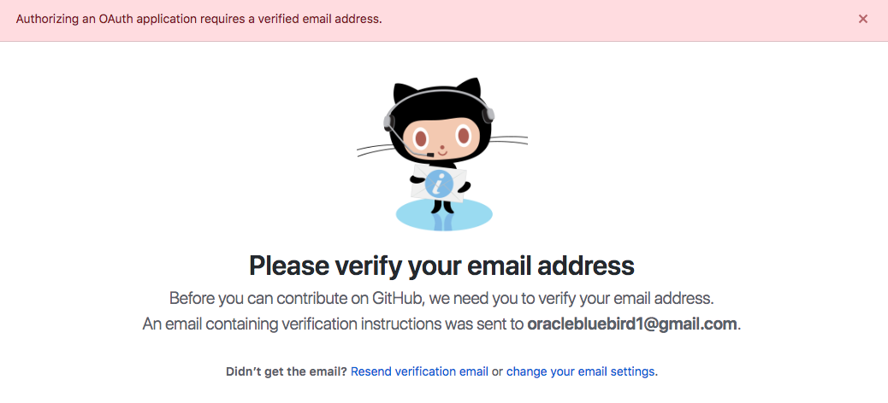
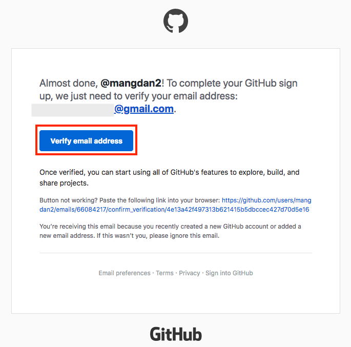

# 마이크로 서비스 개발을 위한 API 우선 설계 및 API 구축하기

본 문서는 Oracle Apiary에서 API Blueprint를 활용하여 API 문서를 만들고, 만들어진 문서를 토대로 [Oracle Helidon](http://helidon.io)과 [Oracle Database의 REST Data Service](https://www.oracle.com/database/technologies/appdev/rest.html)로 마이크로 서비스를 구현하는 것을 보여줍니다. 
또한 API 문서와 구현된 서비스간의 "동기화?" 비호환 (서비스에 대응하는 문서 호환 여부) 여부를 확인, 검증하는 [Dredd](https://github.com/apiaryio/dredd) 도구과 CI/CD 도구인 [Wercker](https://app.wercker.com/)를 통합하여 API 비호환 테스트를 지속적으로 자동화하는 것을 방법을 보여줍니다.
마지막으로 컨테이너에 배포된 API에 보안 및 다양한 정책을 적용해 보고, 최종적으로 API Gateway에 배포하여 서비스와 문서를 애플리케이션 개발자에게 오픈하는 내용을 담고 있습니다.
본 문서를 통해 오라클 솔루션을 활용하여 마이크로 서비스 개발에 대한 전반적인 라이프사이클을 경험해 보실 수 있습니다.

## 데스크탑  설치 프로그램
* [Java SE Development Kit 8](https://www.oracle.com/technetwork/java/javase/downloads/jdk8-downloads-2133151.html)
* [Node.js](https://nodejs.org/ko/download)
* [Apache Maven](https://maven.apache.org/download.cgi)
* [Git](https://git-scm.com/download/win)
* [Visual Studio Code](https://code.visualstudio.com/download)
* [SQL Developer](https://www.oracle.com/technetwork/developer-tools/sql-developer/downloads/index.html)
* [Insomnia](https://insomnia.rest/download)

## Oracle Cloud 환경
* [Oracle Compute Cloud Service](https://cloud.oracle.com/ko_KR/compute)
* [Oracle Database Cloud Service](https://cloud.oracle.com/ko_KR/database)
* [Oracle API Platform Cloud Service](https://cloud.oracle.com/ko_KR/api-platform)

## 시나리오
1. Apiary에서 API Blueprint 작성하기
2. Helidon (MP)과 ORDS를 사용하여 서비스 개발하고 Dredd를 사용하여 API Blueprint와 Helidon 서비스간 호환 여부 검증 및 테스트하기
3. Wercker와 Dredd, Github을 사용하여 지속적 통합 환경 구축하기
4. API 서비스에 보안 및 정책을 적용하고 API Gateway에 서비스 배포하기


## API 문서 설계
<details>
<summary>Apiary 계정 생성하기</summary>
API 문서를 작성하고 Mock Test를 하기 위한 Apiary 계정을 생성하는 단계입니다.  
만약 계정을 가지고 있다면 이 단계를 건너뜁니다.  

> [Apiary(https://apiary.io)](https://apiary.io) 홈페이지에 접속한 후 우측 상단의 **Sign up** 버튼을 클릭합니다.  
> 

> **Continue with GitHub** 버튼을 클릭합니다.  
> GitHub 계정이 필요합니다. 만약에 없을 경우 [GitHub(https://github.com)](https://github.com)에서 계정을 생성하세요.  
> 

> GitHub 계정을 입력하고 **Sign In** 버튼을 클릭합니다.  
> 

> GitHub에서 verify를 위한 메일이 발송됩니다.  
> 

> GitHub 로그인 메일 계정으로 접속하여 verify 메일을 확인하고 **verify email address**를 클릭 합니다.  
> 

> 다시 Apiary 홈페이지로 접속한 후 우측 상단의 **Sign In** 버튼을 클릭, **Continue with GitHub** 버튼을 클릭 합니다.  
> 

> GitHub 계정을 입력하고 **Sign In** 버튼을 클릭합니다.  
> 

> Apiary 계정을 생성하면 기본 API 하나를 생성해야 합니다.  
> **Name your first API** 부분에 *myfirstapi* 혹은 *helloapiary* 와 같이 임의로 입력합니다.  
> 

> Apiary 계정을 성공적으로 생성하였습니다. :clap:  
> 아래 화면은 Apiary 에디터 화면으로 좌측이 에디터, 우측이 실시간으로 만들어지는 API 문서입니다.  
> 
</details>

<details>
<summary>API Blueprint 프로젝트 만들기</summary>
이제 API 프로젝트를 하나 만들어 보겠습니다.

> 좌측 상단의 API 이름을 클릭한 후 **Create New API Project**를 선택합니다.  
> 

> **Personal API**를 선택하고 API 이름은 **Movie API** 라고 입력합니다.  
> 문서 유형은 API Blueprint와 Swagger 2.0 스펙을 지원하는데, 여기서는 API Blueprint로 문서를 작성합니다.
>>:warning: **참고 : Personal API와 Team API**  
>>Personal API는 무료 서비스로 개인만 작업이 가능하며, 팀단위 협업 기능은 지원하지 않습니다.  
>>또한 작성된 API 문서는 해당 문서의 URL만 알면 누구나 볼 수 있도록 공개됩니다.  
>>유료 서비스인 Enterprise 버전을 구매할 경우 팀 단위 협업이 가능한 Team API 문서를 생성할 수 있습니다.  
>>Team API는 팀멤버를 구성하고 팀멤버만 볼 수 있는 Private API로 구성할 수 있습니다. 

> 
>> :warning: **참고 : API Blueprint와 Swagger**  
>> API Blueprint와 Swagger는 API 문서 작성 시 가장 많이 사용되고 있는 API 문서 정의 언어입니다.  
>> 이외에 MuleSoft의 RAML(YAML)과 Slate(Markdown), Asciidoc (Spring-boot REST Doc 에서 기본으로 사용)  
>> 등이 있습니다. API Blueprint의 경우 API 문서를 생성하는데 포커스가 맞쳐져 있습니다. 반면에, Swagger는 API를  
>> 정의하는데 포커스가 맞춰져 있다고 볼 수 있습니다.  API Blueprint는 개발자가 아니어도 쉽게 배울 수 있으며, 작성하기  
>> 쉽고 이해하기 쉬운 마크다운 형식을 지원합니다.  
>> 문서를 위한 스펙이기 때문에 실제 구현을 위한 정의가 Swagger에 비해 상대적으로 많이 포함되지 않아, 스텁이나 스니펫과  
>> 같은 코드 생성 기능을 제공하기 어렵습니다. Swagger는 Linux Foundation의 오픈소스 프로젝트인 OpenAPI Initiative에  
>> 추가되면서 현재는 Open API Specification (OAS) 이라는 이름으로 불리고 있습니다.  
>> 개발자에게 친숙한 JSON, YAML 형식으로 작성하며, 구현을 위한 여러가지 스펙을 제공하기 때문에 개발자 사이에서 많이 사용되고  
>> 있으며, 다양한 언어의 스텁 코드를 생성할 수 있는 기능도 제공될 수 있습니다. (e.g. Swagger Codegen)  
>> 반면에 API Blueprint에 비해서 구현과 관련된 많은 내용이 포함되기 때문에 비 개발자에게는 다소 복잡하게 느껴질 수 있습니다.  
>> Swagger는 문서의 복잡성이 높기 때문에 문서를 먼저 만들고 API를 만들기 보다는 이미 만들어진 API에서 Swagger문서를 추출하는  
>> 방식으로 더 많이 사용됩니다. (ORDS를 포함 많은 개발 언어 및 프레임웍에서 Swagger 생성 기능을 제공합니다.)  
>> 따라서, 일반적으로 Design First 를 말할때는 API Blueprint, Code First를 말할때는 Swagger를  
>> 떠올리면 됩니다. (물론 Swagger가 더 익숙한 사용자라면 Swagger가 Design First Approach가 될 수 있습니다.)  

> 생성을 하게 되면 좌측에 샘플 API Blueprint 마크다운과 에디터가 보이고, 우측에 HTML 문서가 보입니다.  
> 
</details>

<details>
<summary>API Blueprint 문서 작성하기</summary>
이제부터 Movie API 문서를 작성하겠습니다.  
:memo: **마크가 표기되어 있는 부분만 변경 또는 재작성합니다.**  

> API Blueprint 버전 정도로 생각하면 됩니다.  
> 현재 API Blueprint spec은 1A revision 9 입니다.  
> ```markdown
> FORMAT: 1A
> ```

> 실제 서비스할 Production 서버의 주소입니다.  
> 처음에는 Production 환경이 없기 때문에 변경하지 않습니다.
> ```markdown
> HOST: http://polls.apiblueprint.org/
> ```

> API 문서 이름입니다. 한글도 가능합니다.
> ```markdown
> # Movie API
> ```

> :memo:**수정**  
> API에 대한 설명, 소개를 적는 부분입니다.  
> 변경 전 부분을 아래와 같이 수정합니다.  
> *변경 전*
> ```diff
> - Polls is a simple API allowing consumers to view polls and vote in them.
> ```
> *변경 후*
> ```markdown
> 영화 정보를 제공하는 API 입니다.
> ```

> :memo:**수정**  
> API에 대한 엔드포인트 URL입니다.  
> 변경 전 부분을 아래와 같이 수정합니다.  
> *변경 전*
> ```diff
> - ## Questions Collection [/questions]
> ```
> *변경 후*
> ```markdown
> ## Movies Collection [/movies]
> ```

> :memo:**수정**  
> API 엔드포인트에 대한 Action (Method)를 정의합니다.  
> 변경 전 부분을 아래와 같이 수정합니다.  
> *변경 전*
> ```diff
> + ### List All Questions [GET]
> ```
> *변경 후*
> ```markdown
> ### List All Movies [GET]
> ```

> :memo:**수정**  
> 응답 JSON 샘플을 다음과 같이 변경합니다.  
> *변경 전*
> ```diff
> -        [
> -            {
> -                "question": "Favourite programming language?",
> -                "published_at": "2015-08-05T08:40:51.620Z",
> -                "choices": [
> -                    {
> -                        "choice": "Swift",
> -                        "votes": 2048
> -                    }, {
> -                        "choice": "Python",
> -                        "votes": 1024
> -                    }, {
> -                        "choice": "Objective-C",
> -                        "votes": 512
> -                    }, {
> -                        "choice": "Ruby",
> -                        "votes": 256
> -                    }
> -                ]
> -            }
> -        ]
> ```
> *변경 후*
> ```markdown
>         [
>             {
>                 "id": 19995,
>                 "title": "Avatar",
>                 "year": "2009",
>                 "runtime" : 100
>             },
>             {
>                 "id": 2699,
>                 "title": "Titanic",
>                 "year": "1997",
>                 "runtime" :194
>             }
>         ]
> ```

> 두번 째 API Action을 수정 합니다.
> :memo:**수정**  
> Action을 다음과 같이 수정합니다.
> *변경 전*
> ```diff
> - ### Create a New Question [POST]

> - You may create your own question using this action. It takes a JSON
> - object containing a question and a collection of answers in the
> - form of choices.
> ```
> *변경 후*
> ```markdown
> ### Get a Movie [GET /movies/{id}?{title}]

> Movie ID와 Title로 조회하여 상세 Movie 정보를 반환합니다.
> ```

> :warning: **참고 : Path Parameter 와 Query Parameter**  
> Path Parameter는 REST URL Path에 포함되는 파라미터로 http://{host}:{port}/{endpoint}/{path_param}/ 형태로  
> 사용되며 필수로 포함되어야 합니다.  
> Query Parameter는 URL에 ?다음에 붙는 파라미터로 key=value 형태로 사용되며, 옵셔널한 값이 사용될 수 있습니다.  
> 위 내용 중 {id} 부분이 Path Parameter를 의미하며, ?{title} 부분이 Query Parameter 입니다.  

> :memo:**수정**  
> Request 부분을 다음과 같이 수정합니다.
> *변경 전*
> ```diff
> - + Request (application/json)
>
> -        {
> -            "question": "Favourite programming language?",
> -            "choices": [
> -                \"Swift\",
> -                \"Python\",
> -                \"Objective-C\",
> -                \"Ruby\"
> -            ]
> -        }
> ```
> *변경 후*
> ```markdown
> + Parameters
>     - id : 19995 (string, required)
>     - title : Avatar (string, optional)
    
> + Request
>     + Header
            
>             Authorization : Basic AAA
> ```
> :memo:Response 변경
> Response 부분을 다음과 같이 수정합니다.  
> 변경 전
> ```diff
> - + Response 201 (application/json)

> -    + Headers
> -
> -            Location: /questions/2

> -    + Body

> -            {
> -                \"question\": \"Favourite programming language?\",
> -                \"published_at\": \"2015-08-05T08:40:51.620Z\",
> -                \"choices\": [
> -                    {
> -                        \"choice\": \"Swift\",
> -                        \"votes\": 0
> -                    }, {
> -                        \"choice\": \"Python\",
> -                        \"votes": 0
> -                    }, {
> -                        \"choice": \"Objective-C\",
> -                        \"votes": 0
> -                    }, {
> -                        \"choice": \"Ruby\",
> -                        \"votes": 0
> -                    }
> -                ]
> -            }
> ```

> *변경 후*
> ```markdown
> + Response 200 (application/json)
>     + Attributes
>         + id : 2699
>         + title : Titanic
>         + year : 1997
>         + runtime : 194
>         + Include MovieDetail
>         + genres (array[Genres])


> # Data Structure

> ## MovieDetail (object)
> - overview : In the 22nd century, a paraplegic Marine is dispatched to the moon Pandora on a unique mission, but becomes torn between following orders and protecting an alien civilization. (string)
> - releaseDate : 2009.12.10
> - status : Released
> - homepage : http://www.titanicmovie.com
> - vote_average : 7.2
> - vote_count : 12114


## Genres (object)
> - id : 18 (number, required)
> - name : Drama (string, required)
> ```
</details>
